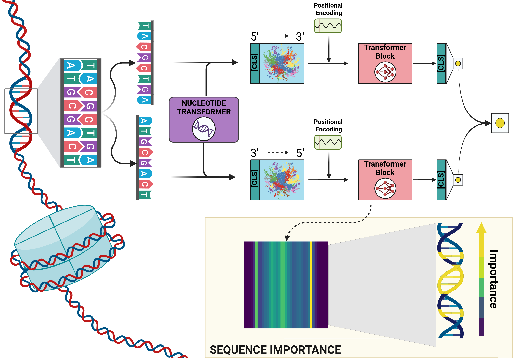

# DyNA (CadmusDNA): Interpretable Nucleosome Prediction

This repository contains the official implementation of the **DyNA** (also referred to as **CadmusDNA** in the codebase) architecture, a Transformer-based model designed for high-accuracy and interpretable nucleosome positioning prediction. 

The pipeline is divided into two main phases: an initial benchmarking/hyperparameter optimization phase, and the main training/testing phase which includes downstream explainability studies.


---

## Phase 1: Benchmarking & Hyperparameter Tuning

This initial phase uses the external *Homo sapiens* (HS) dataset to establish baselines and find the optimal hyperparameters for the model.

### 1. Data Processing
To process the external HS data and generate the necessary embeddings, use:
`data_processing_embedding.py`

### 2. Hyperparameter Optimization
To run the hyperparameter optimization, execute: `hyperparameters_searching_and_benchmarking_results.py`

We utilized the Optuna framework on the external HS dataset to search for the optimal model configuration. Notably, while performing the search, this script simultaneously outputs the model's performance on the blind test set that is left out during cross-validation. 

The optimization results and the complete trial history are persistently stored in an SQLite database. You can access them using the study name `optuna_results` within the `optuna_results.db` file. 

---

## Phase 2: Main Phase (Training & Testing)

In the main experimental phase, the model is trained on **Lymphoblastoid Human Cells** and tested on **CD4+ T Human Cells** to evaluate cross-cell-line generalization.

### 1. Data Preprocessing Pipeline
The raw MNase-seq data is provided as WIG files. Follow these steps in order to process the raw data into the final format required by the model:

* **Step 1.1: Genome Assembly Conversion (hg18 -> hg19)**
  The original Train and Test WIG files are mapped to the `hg18` assembly. Convert the mapping to `hg19` using:
  `Convert_Genome_hg18_to_hg19.py`

* **Step 1.2: WIG to CSV Conversion**
  Extract the relevant sequence coordinates and labels from the hg19 WIG files by running:
  `creation_data_from_wig_to_csv.ipynb`

* **Step 1.3: CSV to PKL Conversion**
  Convert the CSV files into serialized Pickle (`.pkl`) objects for efficient dataloading during training:
  `creation_data_from_csv_to_pkl.ipynb`

### 2. Model Training
To train the CadmusDNA model and obtain the final weights, run the main training script. This script utilizes **5-fold cross-validation**:
`train_CadmusDNA.py`

*Output:* This will generate 5 distinct model weight files corresponding to each fold, saved as: 
`best_model_weights_99_8_percentile_fold{fold}.pt` (where `{fold}` ranges from 0 to 4).

### 3. Ensemble Predictions & Attention Extraction

The `predictions.py` script is designed to run inference on a selected dataset using an ensemble of the 5 pre-trained models. 

It performs two crucial tasks:
1. **Ensemble Scoring:** Computes the prediction probabilities for each fold and averages them to produce a robust final score.
2. **Attention Extraction:** Extracts the directional and reverse-complement attention matrices from the transformer layers, saving them as PyTorch tensors. These matrices are strictly required to run the downstream `explainability.py` script.

You can execute the script from the terminal by specifying which dataset you want to process using the `--dataset` flag:

```bash
python predictions.py --dataset act
```

| Argument | Description | Default | Required |
| :--- | :--- | :---: | :---: |
| `--dataset` | The target dataset to process. Choices: `lympho`, `act`, `rest`. | - | ✅ Yes |

After running the script, the following files will be automatically generated and saved in your working directory (ready to be fed into the explainability tool):
* **`preds_[dataset]_model_fold[0-4]...pkl`**: Individual prediction probabilities for each of the 5 folds.
* **`preds_[dataset]_model_sum_folds...pkl`**: The final averaged ensemble predictions.
* **`matrices_results_fold[0-4]_[dataset].pt`**: PyTorch checkpoint files containing the extracted raw attention matrices (`matrices_dir` and `matrices_rc`).


### 4. Explainability & Visualization

To interpret the model's decision-making process, analyze attention weights, and visualize the most important k-mers and sequence positions, use the `explainability.py` CLI tool.

You can run the script from the terminal by combining intuitive flags. 

**Example 1: Full Analysis** Generate all available plots (Attention + Biophysics + JASPAR Motifs) for the **Activated CD4+ T cells** dataset, focusing on the **dyad** region:
```bash
python explainability.py \
  --cell_type act \
  --region dyad \
  --all_plots \
  --results_dir . --data_dir . --out_dir .
```

**Example 2: Specific Plotting** Generate *only* the Biophysical Profiles and Motif Enrichment plots for the **Lymphoblastoid** dataset:
```bash
python explainability.py \
  --cell_type lympho \
  --plot_physics \
  --plot_motifs
```

| Argument | Description | Default | Required |
| :--- | :--- | :---: | :---: |
| `--cell_type` | Target dataset to analyze. Choices: `lympho`, `act`, `rest`. | - | ✅ Yes |
| `--filter` | Filter by prediction accuracy (for K-mer/Position plots). Choices: `all`, `tp`, `tn`. | `all` | ❌ No |
| `--region` | Genomic region of interest. Choices: `dyad`, `boundary`, `global`. | `global` | ❌ No |
| `--top_k` | Number of top k-mers to display in the attention lollipop plot. | `20` | ❌ No |
| `--data_dir` | Directory containing the `.pkl` dataset files. | `../data/data_pkl` | ❌ No |
| `--results_dir`| Directory containing the saved attention matrices (`.pt`) and predictions (`.pkl`). | `../results` | ❌ No |
| `--out_dir` | Directory where the generated plots (`.png`) will be saved. | `../images` | ❌ No |

You must specify at least one flag to generate outputs:
* `--all_plots`: Generates **all** available plots.
* `--plot_kmers`: Generates the Lollipop chart showing the top attended 6-mers.
* `--plot_positions`: Generates the Bar plot showing the mean attention weight across sequence positions.
* `--plot_physics`: Generates the 3x2 Violin plots comparing biophysical properties between Anchor, Linker, and Background sequences.
* `--plot_motifs`: Scans the JASPAR database to generate a Volcano Plot showing motif enrichment.

---

## Inference

To generate predictions and extract attention matrices on new data, you can use the `inference.py` script via the command line.

### Required Data Format
The input dataset must be a `.pkl` (Pickle) file containing a **list of dictionaries**. Each dictionary represents a single sample and **must** contain the keys `'sequence'` (the forward DNA sequence) and `'rev_sequence'` (its reverse complement). 

*Example of the `.pkl` structure:*
```python
[
    {
        'sequence': 'GATGAGTAGAATCCCCCAGAAAGGAG...',
        'rev_sequence': '...CTCCTTTCTGGGGGATTCTACTCATC'
    },
    {
        'sequence': 'ATGCGTACGTAGCTAGCTAGCTAGCA...',
        'rev_sequence': '...TGCTAGCTAGCTAGCTACGTACGCAT'
    }
]
```

Execute the script from the terminal by specifying the path to your dataset and the trained model weights (`.pt`):

```bash
python inference.py \
  --dataset "path/to/your/dataset.pkl" \
  --weights "path/to/your/best_model_weights.pt" \
  --output_dir "./results" \
  --batch_size 32
```

| Argument | Description | Default | Required |
| :--- | :--- | :---: | :---: |
| `--dataset` | Path to the `.pkl` file containing the data to analyze. | - | ✅ Yes |
| `--weights` | Path to the model weights file (`.pt`). | - | ✅ Yes |
| `--output_dir`| Directory where results will be saved. Created automatically if it doesn't exist. | `./results` | ❌ No |
| `--batch_size`| Batch size for inference (reduce if you encounter VRAM/memory issues). | `32` | ❌ No |

Upon completion, you will find the following files in the directory specified by `--output_dir` (e.g., `./results`):
1. **`predictions.csv`**: A CSV file containing the computed probabilities (`probabilities`) and the predicted labels (`predictions`) for each sequence.
2. **`attention_matrices.pkl`**: A Pickle file containing the raw attention matrix tensors for each sample, ready for downstream analysis.
3. **`attention_sample_0.png`**: A bar chart (PNG) visually displaying the Attention Score across 6-mers for the first sample in your dataset.
